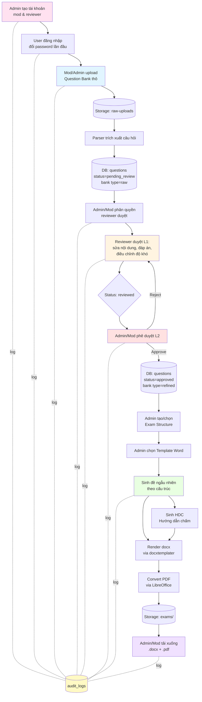
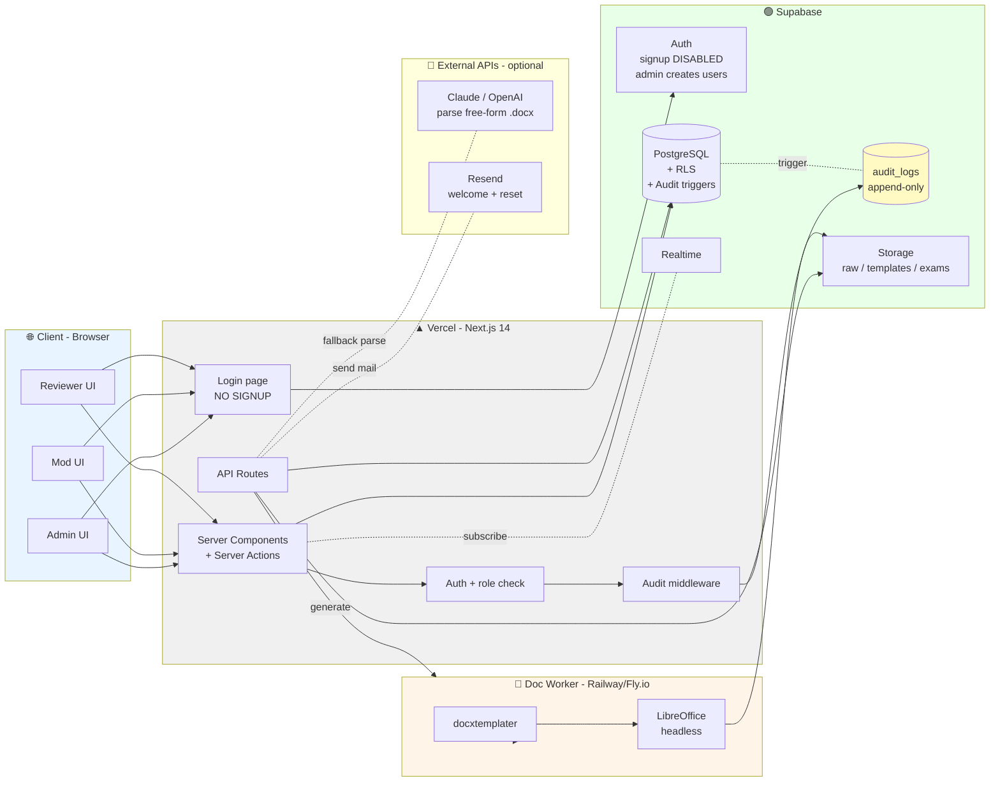
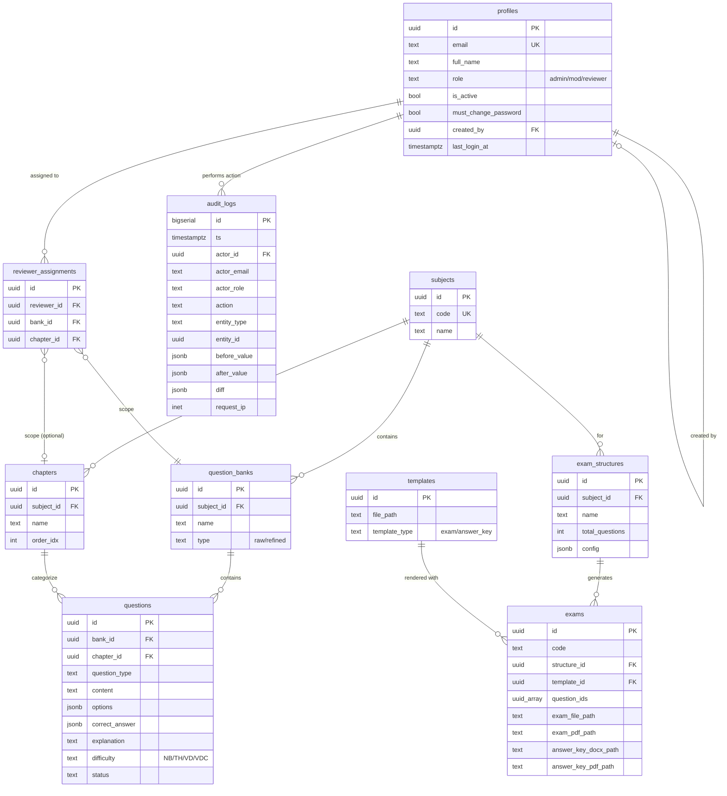
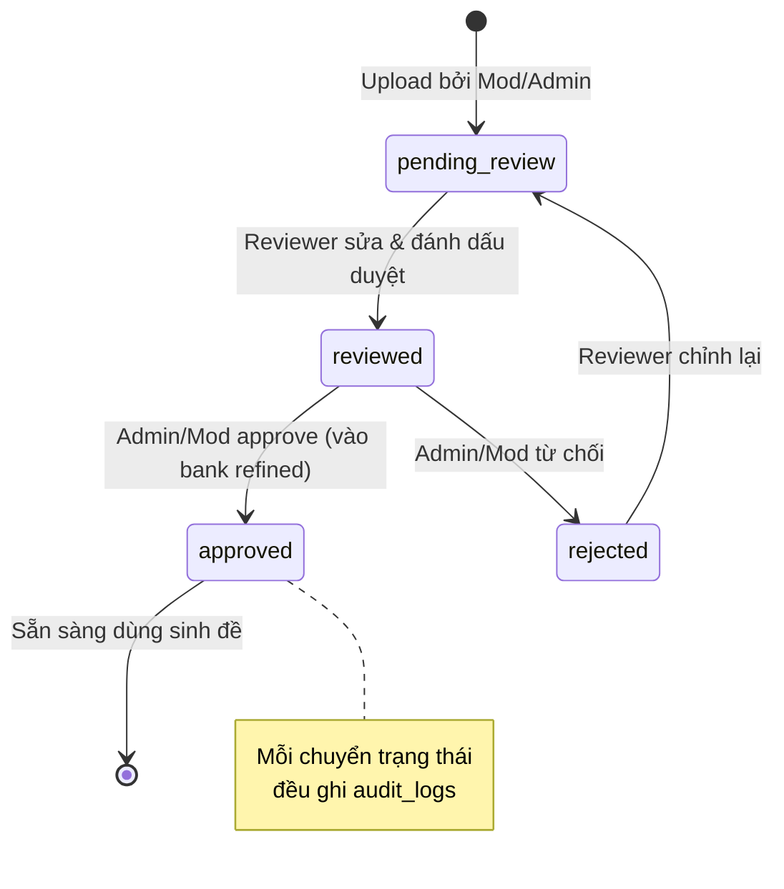
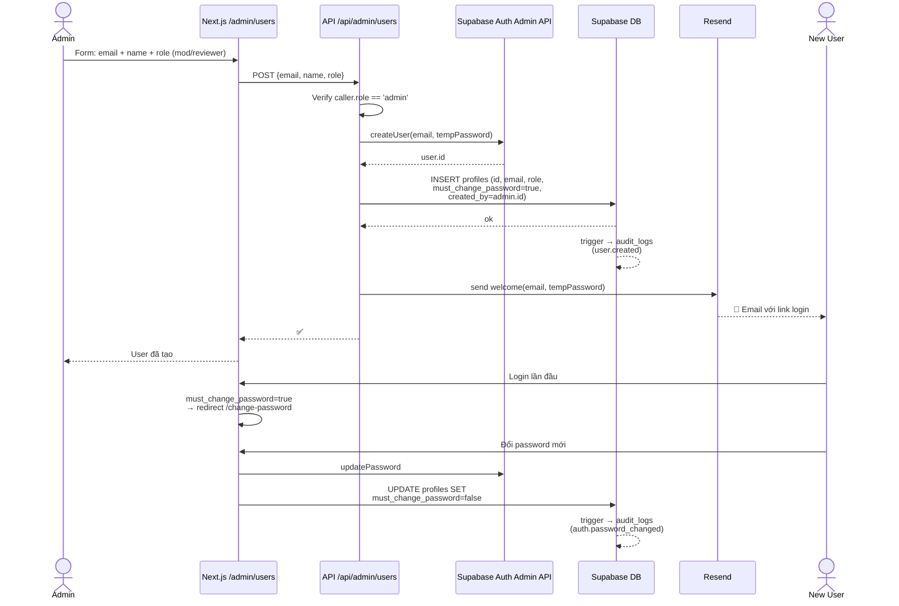
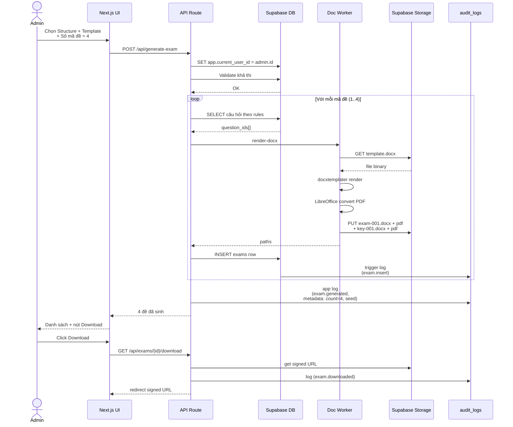

# SƠ ĐỒ FLOW & KIẾN TRÚC — SinhDeDoAI

> **Version:** 1.1 | **Cập nhật:** 2026-05-21
> Thay đổi v1.1: 3 role (admin/mod/reviewer), bỏ public signup, thêm audit logging xuyên suốt.

## 1. Luồng nghiệp vụ tổng thể (Business Flow)



---

## 2. Kiến trúc hệ thống (System Architecture)



---

## 3. ER Diagram (rút gọn, v1.1)



---

## 4. State Machine của một Question



---

## 5. Sequence Diagram — Tạo tài khoản (Admin only)



---

## 6. Sequence Diagram — Sinh đề thi (có audit)



---

## 7. Phân quyền theo Role (Permission Matrix v1.1)

> **3 role: Admin / Mod / Reviewer. Không có Viewer hay Public.**

| Hành động | Admin | Mod | Reviewer |
|----------|:-----:|:---:|:--------:|
| **Quản lý user** | | | |
| Tạo tài khoản | ✅ | ❌ | ❌ |
| Đổi role / Reset pw | ✅ | ❌ | ❌ |
| Vô hiệu hóa user | ✅ | ❌ | ❌ |
| **Nội dung** | | | |
| Tạo Subject / Chapter | ✅ | ✅ | ❌ |
| Upload bank thô | ✅ | ✅ | ❌ |
| Phân quyền reviewer | ✅ | ✅ | ❌ |
| Duyệt L1 (sửa nội dung) | ✅ | ✅ | ✅ (assigned only) |
| Approve / Reject L2 | ✅ | ✅ | ❌ |
| **Sinh đề** | | | |
| Tạo / sửa Exam Structure | ✅ | ❌ | ❌ |
| Upload Template | ✅ | ✅ | ❌ |
| Sinh đề | ✅ | ✅ | ❌ |
| Tải đề đã sinh | ✅ | ✅ | ❌ |
| **Audit** | | | |
| Xem audit log toàn hệ thống | ✅ | ❌ | ❌ |
| Xem audit log của chính mình | ✅ | ✅ | ✅ |
| Export audit log | ✅ | ❌ | ❌ |

---

## 8. Mô hình Audit Log Flow ⭐ MỚI

```mermaid
flowchart LR
    subgraph App["Application Layer"]
        Action1[User action:<br/>edit question]
        Action2[User action:<br/>login]
        Action3[User action:<br/>upload file]
        Action4[User action:<br/>generate exam]
    end

    subgraph DBLayer["Database Layer"]
        Tables[(questions<br/>profiles<br/>exams<br/>structures<br/>assignments)]
        Trigger{Postgres<br/>AFTER<br/>INSERT/UPDATE/DELETE<br/>trigger}
    end

    subgraph AppLog["App Logger"]
        Logger[lib/audit/logger.ts<br/>logAudit&#40;&#41;]
    end

    AuditTable[(audit_logs<br/>APPEND-ONLY<br/>no UPDATE/DELETE)]

    Action1 --> Tables
    Action3 --> Tables
    Action4 --> Tables
    Tables --> Trigger
    Trigger --> AuditTable

    Action2 --> Logger
    Action3 --> Logger
    Action4 --> Logger
    Logger --> AuditTable

    AuditTable --> UI[/admin/audit-logs<br/>UI viewer/]
    AuditTable --> Export[Export CSV<br/>by Admin]
    AuditTable -.monthly.- Archive[Archive<br/>to Storage<br/>after 12 months]

    style AuditTable fill:#fff9c4
    style Trigger fill:#ffcccc
```



**Tầng 1 (DB Trigger):** Mọi INSERT/UPDATE/DELETE trên bảng quan trọng tự động ghi log → không thể bypass.

**Tầng 2 (App Logger):** Login, upload, generate, download — những action không gắn 1 dòng DB cụ thể.

**Quy tắc bảo vệ:**
- Bảng `audit_logs` chỉ INSERT được, không UPDATE/DELETE (RULE level + RLS)
- Chỉ Admin SELECT được toàn bộ
- Mod/Reviewer chỉ SELECT row có `actor_id = chính mình`

---

## 9. Mô hình dữ liệu Exam Structure (JSONB config)

Ví dụ cấu hình một đề thi THPT QG Toán:

```json
{
  "exam_meta": {
    "subject": "Toán 12",
    "time_min": 90,
    "total_score": 10
  },
  "sections": [
    {
      "name": "Phần I — Trắc nghiệm 4 đáp án",
      "question_type": "MCQ_SINGLE",
      "instruction": "Chọn 1 đáp án đúng cho mỗi câu",
      "rules": [
        { "chapter": "Hàm số", "difficulty": "NB", "count": 4 },
        { "chapter": "Hàm số", "difficulty": "TH", "count": 4 },
        { "chapter": "Mũ - Logarit", "difficulty": "TH", "count": 3 },
        { "chapter": "Nguyên hàm", "difficulty": "VD", "count": 2 },
        { "chapter": "Hình học", "difficulty": "VDC", "count": 1 }
      ],
      "shuffle_options": true
    },
    {
      "name": "Phần II — Đúng/Sai",
      "question_type": "TRUE_FALSE",
      "rules": [
        { "chapter": "Hàm số", "difficulty": "TH", "count": 2 },
        { "chapter": "Hình học", "difficulty": "VD", "count": 2 }
      ]
    },
    {
      "name": "Phần III — Tự luận ngắn",
      "question_type": "SHORT_ANSWER",
      "rules": [
        { "chapter": "Tích phân", "difficulty": "VD", "count": 3 },
        { "chapter": "Hình học", "difficulty": "VDC", "count": 3 }
      ]
    }
  ]
}
```

---

*Sơ đồ v1.1 — Mở các file `.md` bằng VS Code (extension Markdown Preview Mermaid Support) hoặc GitHub để xem render trực tiếp.*    
